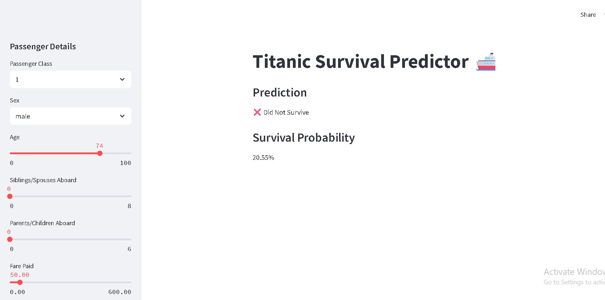

# 🚢 Titanic Survival Prediction App

A machine learning web application that predicts Titanic passenger survival using logistic regression.

---

## 📚 Table of Contents

- [Features](#features)
- [Demo](#demo)
- [Installation](#installation)
- [Usage](#usage)
- [Dataset](#dataset)
- [Model](#model)
- [Contributing](#contributing)
- [License](#license)

---

## 🚀 Features

- Interactive Streamlit web UI
- Real-time passenger survival prediction
- Logistic regression-based classifier
- Survival probability score
- Auto-training if model not found
- Supports local and Streamlit Cloud deployment

---

## 🌐 Demo

  

---

## 🛠 Installation

1. Clone the repository:
git clone https://github.com/your-username/titanic-survival-app.git
cd titanic-survival-app 

2.Install dependencies:
pip install -r requirements.txt

